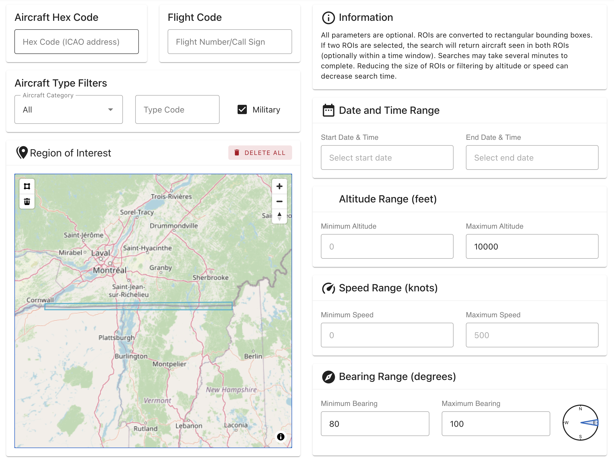
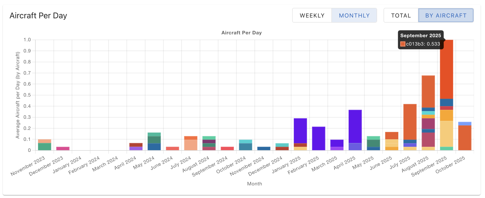
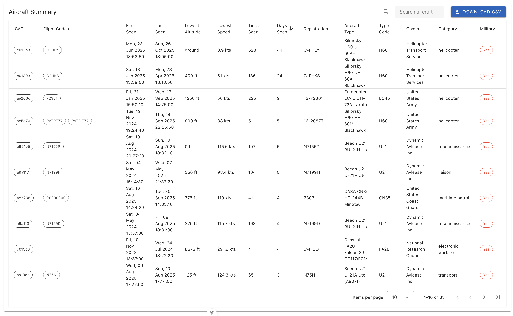

# ADS-B History

A full-stack application for collecting, storing, and querying historical ADS-B aircraft tracking data. This system enables sophisticated spatial and temporal queries on aircraft positions, with support for filtering by geographic regions, altitude, speed, bearing, aircraft type, and more.





## Overview

This project consists of three main components:

1. **Backend Data Loading** - Processes tar1090 heatmap binary files and loads them into PostgreSQL
2. **Backend API** - Flask-based REST API with Firebase authentication
3. **Frontend** - Vue.js web application with interactive maps and query builder

## Architecture

### Database Schema

The main `adsb` table contains:
- `t` - Timestamp with timezone
- `hex` - Aircraft ICAO hex identifier
- `flight` - Flight number/call sign
- `alt` - Altitude in feet
- `gs` - Ground speed in knots
- `geom` - PostGIS geometry (point) for location
- `bearing` - Heading in degrees
- `registration` - Aircraft registration number
- `typecode` - Aircraft type code
- `category` - Aircraft category (e.g., "Airliner", "General Aviation", "UAV")
- `military` - Boolean flag for military aircraft

The `modes` table provides additional aircraft metadata based on ICAO hex codes. This is distributed in `backend-data-loading/modes.csv` as a slightly modified version of the data distributed at https://github.com/wiedehopf/tar1090, with attributes about aircraft category and military use.

## Prerequisites

### Backend Data Loading
- Python 3.x
- PostgreSQL with PostGIS extension
- Required Python packages (see `backend-data-loading/requirements.txt`)

### Backend API
- Python 3.x
- PostgreSQL database (configured)
- Firebase project with authentication enabled
- Required Python packages (see `backend-api/requirements.txt`)

### Frontend
- Node.js (v16+)
- npm or yarn
- Firebase project (matching backend)

## Installation

### 1. Backend Data Loading

```bash
cd backend-data-loading
pip install -r requirements.txt
```

**Database Setup:**

```sql
-- Create database
CREATE DATABASE adsb;

-- Enable PostGIS
CREATE EXTENSION postgis;

-- Create main table
CREATE TABLE adsb (
    t TIMESTAMP WITH TIME ZONE,
    hex TEXT,
    flight TEXT,
    alt BIGINT,
    gs DOUBLE PRECISION,
    geom GEOMETRY(Point, 4326),
    bearing DOUBLE PRECISION,
    registration TEXT,
    typecode TEXT,
    category TEXT,
    military BOOLEAN
);

-- Create temporary loading table
CREATE TABLE adsb_temp (
    t DOUBLE PRECISION,
    hex TEXT,
    flight TEXT,
    squawk TEXT,
    lat DOUBLE PRECISION,
    lon DOUBLE PRECISION,
    alt BIGINT,
    gs DOUBLE PRECISION,
    type INTEGER
);

-- Create modes table for aircraft metadata
CREATE TABLE modes (
    hex TEXT PRIMARY KEY,
    registration TEXT,
    typecode TEXT,
    category TEXT,
    military BOOLEAN,
    owner TEXT,
    aircraft TEXT
);

COPY modes FROM 'modes.csv' DELIMITER ',' CSV HEADER;

-- Create indexes
CREATE INDEX adsb_t_idx ON adsb (t);
CREATE INDEX adsb_hex_idx ON adsb (hex);
CREATE INDEX adsb_geom_idx ON adsb USING GIST (geom);
CREATE INDEX adsb_category_idx ON adsb (category);
```

### 2. Backend API

```bash
cd backend-api
pip install -r requirements.txt
```

**Environment Variables:**

Create a `.env` file in `backend-api/`:

```env
# Database Configuration
DB_HOST=localhost
DB_NAME=adsb
DB_USER=your_db_user
DB_PASS=your_db_password
DB_PORT=5432

# Firebase Configuration
FIREBASE_PROJECT_ID=your-firebase-project-id

# Logging
LOG_FILE=adsb_api.log
```

**Firebase Setup:**

1. Create a Firebase project at https://console.firebase.google.com
2. Enable Authentication (Email/Password, Google, etc.)
3. Download service account credentials JSON
4. Place credentials in `backend-api/` directory (referenced in `firebase_utils.py`)

### 3. Frontend

```bash
cd frontend
npm install
```

**Firebase Configuration:**

Update `frontend/src/firebase.js` with your Firebase project credentials:

```javascript
const firebaseConfig = {
  apiKey: "your-api-key",
  authDomain: "your-project.firebaseapp.com",
  projectId: "your-project-id",
  storageBucket: "your-project.appspot.com",
  messagingSenderId: "your-sender-id",
  appId: "your-app-id"
};
```

## Usage

### Data Loading

Process tar1090 binary files and load into the database:

```bash
cd backend-data-loading
python process_adsb_data.py /path/to/data/directory

# Options:
# --connection-string: Custom database connection string
# --cleanup-files: Delete files after successful processing
# --skip-finalize: Skip finalization (for batch processing)
# --verbose: Enable verbose logging
```

Data can be downloaded from [adsb.lol's data releases](https://github.com/adsblol/globe_history_2025/releases).

For example, data for October 28th, 2025, once downloaded from Github and extracted, can be imported into the database as follows:

```bash
python process_adsb_data.py v2025.10.28-planes-readsb-prod-0/heatmap
```

### Running the API

```bash
cd backend-api
python flask-adsb-api.py
```

The API will start on `http://localhost:5000` by default.

### Running the Frontend

**Development:**
```bash
cd frontend
npm run dev
```

**Production Build:**
```bash
cd frontend
npm run build
```

Built files will be in `frontend/dist/`.

## API Endpoints

### Authentication

All endpoints require Firebase authentication. Include the Firebase ID token in the Authorization header:

```
Authorization: Bearer <firebase-id-token>
```

### GET `/api/adsb/bbox`

Query aircraft positions within a bounding box with optional filters.

**Query Parameters:**
- `bbox` - Bounding box: `min_lon,min_lat,max_lon,max_lat`
- `hex` - Aircraft ICAO hex code
- `flight` - Flight number/call sign
- `start_time` - ISO 8601 timestamp (e.g., `2024-01-01T00:00:00Z`)
- `end_time` - ISO 8601 timestamp
- `min_alt`, `max_alt` - Altitude range in feet
- `min_bearing`, `max_bearing` - Bearing range in degrees (0-360)
- `min_speed`, `max_speed` - Ground speed range in knots
- `military` - Filter military aircraft (`true`/`false`)
- `category` - Aircraft category
- `typecode` - Aircraft type code
- `limit` - Max records (default: 1000, max: 1000000)
- `offset` - Pagination offset (default: 0)

**Response:**
```json
{
  "count": 100,
  "results": [
    {
      "t": "2024-01-01T12:00:00Z",
      "hex": "a12345",
      "flight": "UAL123",
      "lat": 37.7749,
      "lon": -122.4194,
      "alt": 35000,
      "gs": 450.5,
      "bearing": 270.5,
      "registration": "N12345",
      "typecode": "B738",
      "category": "Airliner",
      "military": false,
      "owner": "United Airlines",
      "aircraft": "Boeing 737-800"
    }
  ]
}
```

### GET `/api/adsb/intersect_bboxes`

Find aircraft that were present in two different bounding boxes within a time period.

**Query Parameters:**
- `bbox1`, `bbox2` (required) - Two bounding boxes
- `min_time_diff`, `max_time_diff` - Time difference constraints in seconds
- All other parameters from `/api/adsb/bbox`

**Response:** Same format as `/api/adsb/bbox` but returns positions from both bounding boxes.

## Frontend Features

### Query Builder
- Interactive map for drawing bounding boxes
- Comprehensive filter controls
- Date/time range selection
- Aircraft type filters
- Altitude, speed, and bearing constraints

### Results Visualization
- Interactive map showing aircraft positions
- Data table with sorting and pagination
- Aggregate statistics by aircraft
- Charts showing temporal distribution
- CSV export functionality

### Query History
- Automatic saving of queries to browser IndexedDB
- Quick replay of previous queries
- Query naming and organization
